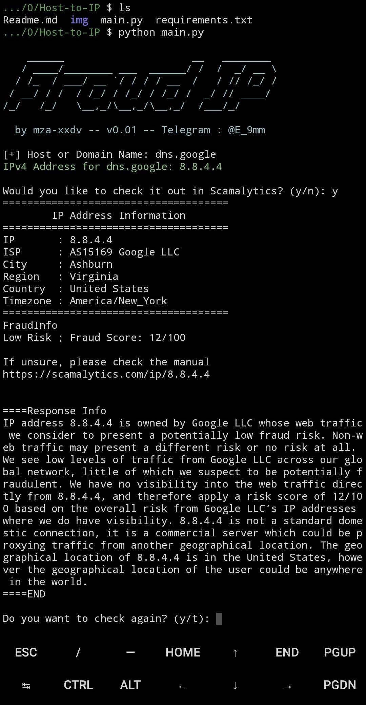

# 🕵️‍♂️ Hostname to IP

## Preview

## 🚀 How to use

Termux - Android (recommended version 0.117 - last)

https://apkcombo.com/id/termux/com.termux/old-versions/0.119.1/

1. pkg upgrade && update
2. pkg install git
3. pkg install python
4. pkg install python-pip
5. termux-setup-storage
6. cd /storage/emulated/0
7. git clone https://github.com/mza-xxdv/Host-to-IP.git
8. cd Host-to-IP
9. ls
10. pip install -r requirements.txt
11. python main.py

## Author
@mza-xxdv